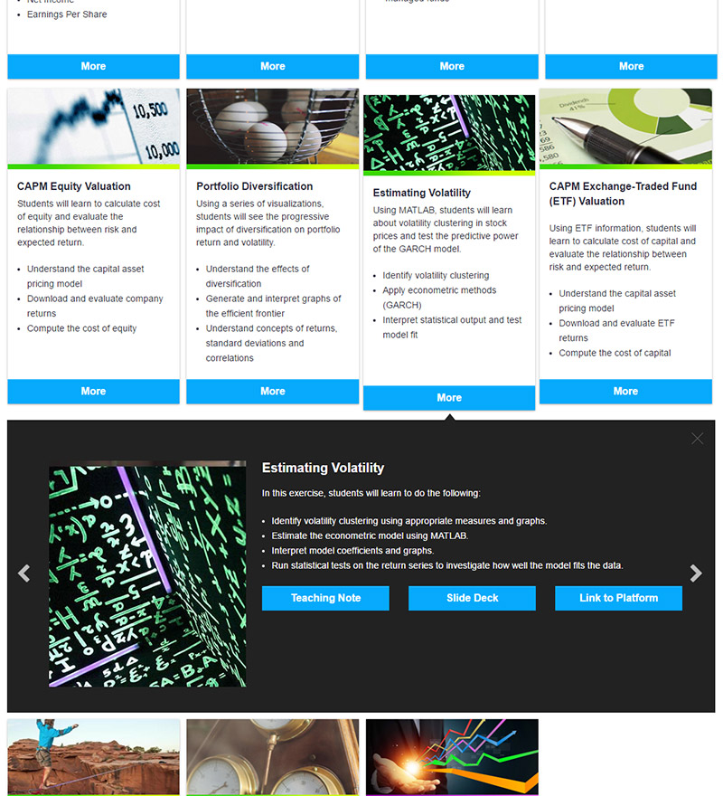
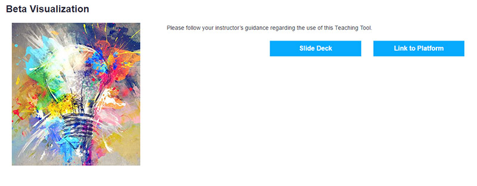
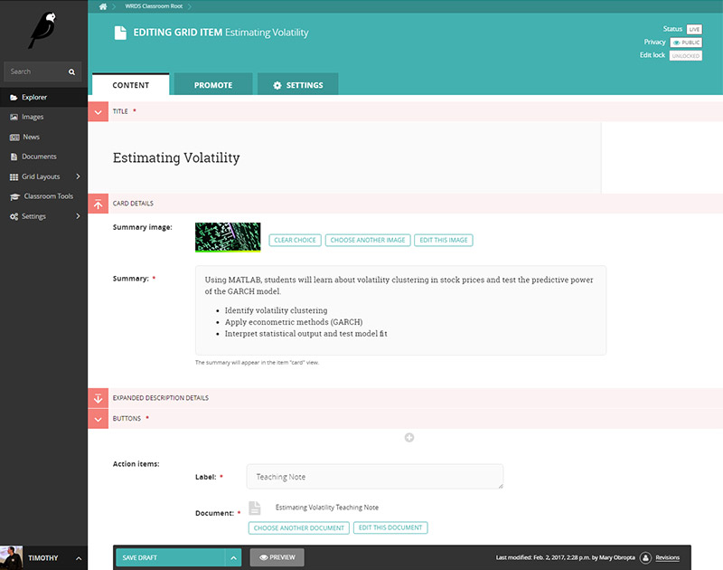
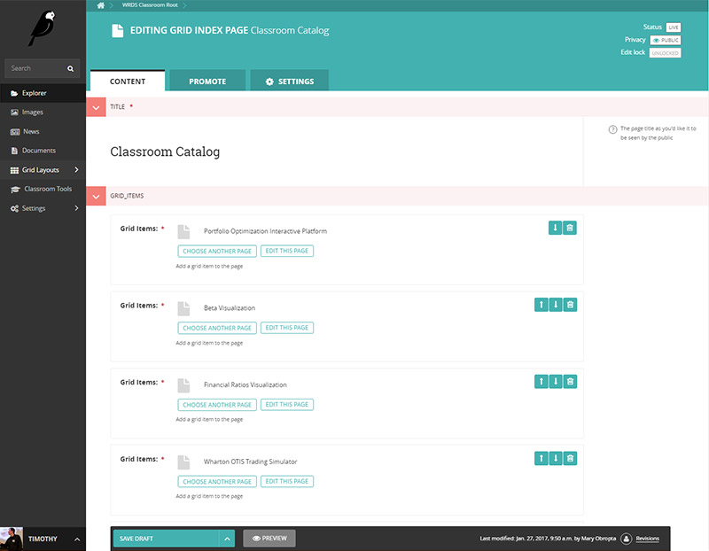

# Wagtail Gridder

Wagtail Gridder is a Bootstrap 4 enabled layout for the Wagtail CMS. Grid Items are created within categories, and displayed on a Grid Index Page. The JavaScript libraries Gridder and MixItUp are included.

# Requirements

* Django >= 1.9
* Wagtail >= 1.8

# Installation

    pip install https://github.com/wharton/wagtailgridder

# Screenshots

## Grid Index Page:

## Grid Index Page, with Grid Item expanded:

## Grid Item landing page:

## Editing a Grid Item:

## Editing a Grid Index Page:

